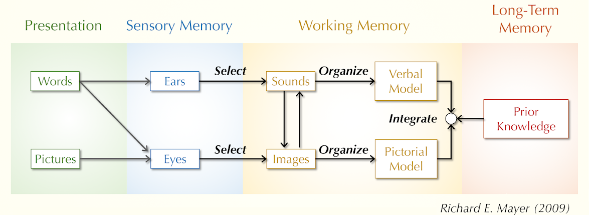

I've found this framework helpful when I'm making lecture slides, handouts, tutorial guides, video presentations, and assessment prompts. Basically, it's relevant to any task that involves creating a presentation that combines words and pictures.  

### Theory  
The Cognitive Theory of Multimedia Learning describes how people mentally process verbal and pictorial information. The theory assumes:  

- working memory has a limited capacity to process information;  
- the processing system involves two separate channels for verbal/auditory and pictorial/visual information;  
- learning is active and involves selecting information, organizing information into mental models, and integrating these models with each other and with previous knowledge.  

  

Based on this theory, empirical research by Richard Mayer and his colleagues have identified ten principles for making presentations easier to process.

### Multimedia principle
Present words with pictures, rather than words alone.

*insert cart example...*

### Coherence principle
Just present essential information, don't include extraneous information.

*insert cart example...*

### Signaling principle  

Provide cues that highlight the organization of essential material.  

*insert cart example...*

### Segmenting principle  
Present bite-sized segments that allow learners to control the pace of the presentation.

*insert cart example...*

### Pretraining principle  
Define key terms and fundamental concepts before exploring relationships.

*insert cart example...*

### Spatial contiguity principle  
Present corresponding words and pictures near each other.

*insert cart example...*

### Temporal contiguity principle  
Presents corresponding words and pictures simultaneously rather than consecutively.  

*insert cart example...*

### Personalization principle  
Present words in a conversational style rather than a formal style.  

*insert cart example...*

### Modality principle  
Present printed images with spoken words, rather than with printed words.

*insert cart example...*

### Redundancy principle  
Present printed images with only spoken words, rather than spoken words and printed words.

*insert cart example...*

### Further Reading:  
Mayer, R.E., 2009. *Multimedia Learning.* Cambridge University Press, Cambridge ; New York.
